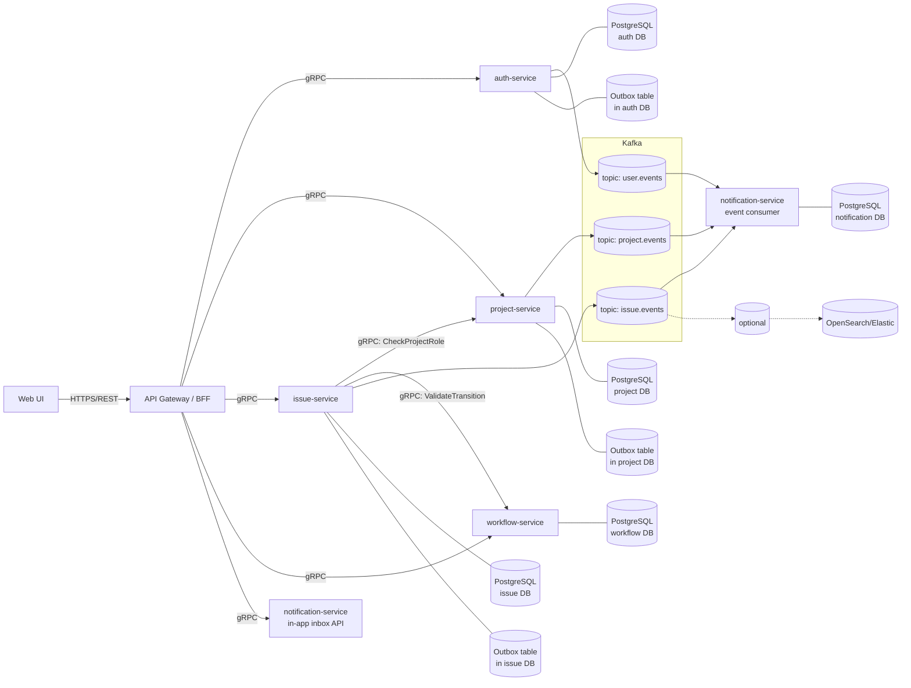

# АС Tasks

Система управления задачами и процессами разработки (аналог Jira)

## Архитектурная схема



## Swagger API Gateway

TODO


## Kafka-UI
#### Запуск

Из корня проекта, где лежит `docker-compose.yml`:

```bash
    docker compose up -d --build kafbat-ui
```
Если нужно поднять весь стек (Kafka + Kafka UI + остальные сервисы) — выполните обычную полную сборку:
```bash
    docker compose up -d --build
```

#### Доступ

После запуска интерфейс доступен по адресу:

**[http://localhost:8088](http://localhost:8088)**

Название кластера в UI: `taska-kafka`.

## Логирование (Loki + Promtail + Grafana)
#### Запуск

Из корня проекта, где лежит `docker-compose.yml`:
```bash
    docker compose up -d loki promtail grafana
```
Если нужно поднять весь стек (Loki + Promtail + Grafana + остальные сервисы) — выполните обычную полную сборку:
```bash
    docker compose up -d --build
```

#### Доступ к интерфейсу
* **Grafana URL**: [http://localhost:3000](http://localhost:3000)
* **Логин/Пароль**: `admin` / `admin` (переменные заданы в `.env.docker`)

#### Как посмотреть логи:
1. Перейдите в Grafana по адресу `http://localhost:3000`.
2. В левом меню выбрать **Dashboards** (Дашборды).
3. Открыть дашборд **AC Taska Logs**.
4. Отобразится дашборд логов. Сверху доступны фильтры:
    * **Сервис**: выбор конкретного микросервиса (`auth-service`, `issue-service` и т.д.). Можно выбрать несколько.
    * **Request ID**: текстовый поиск по requestId запроса.
    * **Node ID**: текстовый поиск по nodeId.
    * **Уровень лога**: фильтрация по уровню логирования (`INFO`, `WARN`, `ERROR` и т.д.). Можно выбрать несколько.

## admin-service

Backend-слой для **platform admin console**.  
Не подключается к пользовательскому frontend и не участвует в обычном user flow через `api-gateway`.

#### Порты (с хоста)

| Назначение | Порт |
|------------|------|
| HTTP / Actuator | `8086` |
| gRPC | `9097` |
| PostgreSQL (`taska_admin_db`) | `5438` |

#### Запуск

Из корня проекта, где лежит `docker-compose.yml`:

```bash
docker compose up -d --build admin-db admin-service
```

Проверка health:

```bash
curl http://localhost:8086/actuator/health
```

Ожидаемый ответ: `{"status":"UP", ...}`.

## Билд и деплой

### Деплой в Docker

### Локальный запуск