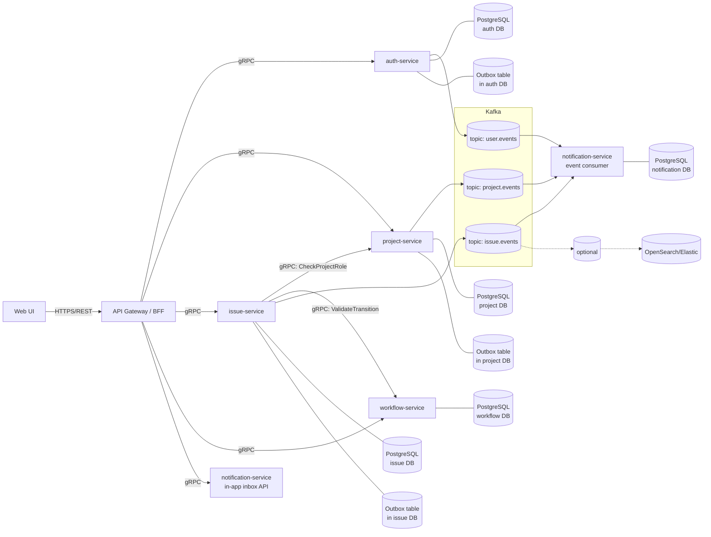

# АС Tasks

Система управления задачами и процессами разработки (аналог Jira)

## Архитектурная схема



## Swagger API Gateway

TODO


## Kafka-UI
#### Запуск

Из корня проекта, где лежит `docker-compose.yml`:

```bash
    docker compose up -d --build kafbat-ui
```
Если нужно поднять весь стек (Kafka + Kafka UI + остальные сервисы) — выполните обычную полную сборку:
```bash
    docker compose up -d --build
```

#### Доступ

После запуска интерфейс доступен по адресу:

**[http://localhost:8088](http://localhost:8088)**

Название кластера в UI: `taska-kafka`.

## Мониторинг (Grafana + Prometheus)
#### Запуск
Поднимаем контейнеры сервисов, db, Prometheus, Grafana
```bash
    docker compose -f docker-compose.yml -f docker-compose.dev.yml --profile infra --profile services up -d --build
```
#### Доступ

После запуска интерфейс Prometheus будет доступен по адресу:

**[http://localhost:9090](http://localhost:9090)**

## Логирование (Loki + Promtail + Grafana)
#### Запуск

Из корня проекта, где лежит `docker-compose.yml`:
```bash
    docker compose up -d loki promtail grafana
```
Если нужно поднять весь стек (Loki + Promtail + Grafana + остальные сервисы) — выполните обычную полную сборку:
```bash
    docker compose up -d --build
```

#### Доступ к интерфейсу
* **Grafana URL**: [http://localhost:3000](http://localhost:3000)
* **Логин/Пароль**: `admin` / `admin` (переменные заданы в `.env.docker`)

#### Как посмотреть логи:
1. Перейдите в Grafana по адресу `http://localhost:3000`.
2. В левом меню выбрать **Dashboards** (Дашборды).
3. Открыть дашборд **AC Taska Logs**.
4. Отобразится дашборд логов. Сверху доступны фильтры:
    * **Сервис**: выбор конкретного микросервиса (`auth-service`, `issue-service` и т.д.). Можно выбрать несколько.
    * **Request ID**: текстовый поиск по requestId запроса.
    * **Node ID**: текстовый поиск по nodeId.
    * **Уровень лога**: фильтрация по уровню логирования (`INFO`, `WARN`, `ERROR` и т.д.). Можно выбрать несколько.

## admin-service

Backend-слой для **platform admin console**.  
Не подключается к пользовательскому frontend и не участвует в обычном user flow через `api-gateway`.

#### Порты (с хоста)

| Назначение | Порт |
|------------|------|
| HTTP / Actuator | `8086` |
| gRPC | `9097` |
| PostgreSQL (`admin_db`) | `5438` |

#### Запуск

Из корня проекта:

```bash
docker compose -f docker-compose.yml -f docker-compose.dev.yml --profile infra --profile services up -d --build admin-db admin-service
```

Проверка health:

```bash
curl http://127.0.0.1:8086/actuator/health
```

Ожидаемый ответ: `{"status":"UP", ...}`.

## Хранилище файлов (MinIO)

#### Запуск

Из корня проекта, где лежит `docker-compose.yml`:
```bash
    docker compose up -d minio minio-init
```
Если нужно поднять весь стек — выполните обычную полную сборку:
```bash
    docker compose up -d --build
```

#### Доступ к консоли

* **MinIO Console**: [http://localhost:9001](http://localhost:9001)
* **Логин/Пароль**: значения `MINIO_ROOT_USER` / `MINIO_ROOT_PASSWORD` из `.env.docker` (по умолчанию `minioadmin` / `minioadmin`)

#### Buckets

При старте `minio-init` автоматически создаёт два bucket-а:

| Bucket | Назначение |
|---|---|
| `taska-avatars` | Аватары пользователей |
| `taska-attachments` | Вложения задач (attachments) |

Имена bucket-ов задаются переменными `MINIO_BUCKET_AVATARS` и `MINIO_BUCKET_ATTACHMENTS` в `.env.docker`.

#### Сброс локального хранилища

```bash
    docker compose down -v
    docker compose up -d minio minio-init
```

Флаг `-v` удаляет volume `minio_data` — все файлы будут удалены, bucket-и пересозданы при следующем запуске.

## Билд и деплой
При добавлении нового сервиса в docker-compose есть несколько правил:

1. Версия image не должна быть latest, нужно указывать конкретную версию.
2. В networks добавлять public если контейнер выходит наружу (Kafa UI, Grafana etc.)
3. env_file = .env, .env файл использует Dokploy в нем же его нужно поправлять,
при локальном запуске используется файл .env.docker.example. 
Пароли из .env и .env.docker.example не должны совпадать.
4. Все порты прописываются в .env.docker.example.
5. restart: unless-stopped
6. Добавляйте профили infra - Для инфраструктуры, services - для сервисов.
Иначе они могут не запуститься при запуске docker-compose.

### Деплой в Docker

### Локальный запуск
Проверка конфигурации без запуска:
```bash
    docker compose -f docker-compose.yml -f docker-compose.dev.yml config
```
Не должна выдавать ошибок, при правильно заполненом .env

Запуск инфраструктуры(Kafka, Grafana, БД и тд.):
```bash
    docker compose -f docker-compose.yml -f docker-compose.dev.yml --profile infra up -d
```
Запуск всего проекта:
```bash
    docker compose -f docker-compose.yml -f docker-compose.dev.yml --profile infra --profile services up -d --build
```

Запуск отдельного сервиса:
```bash
    docker compose -f docker-compose.yml -f docker-compose.dev.yml --profile infra --profile services up -d --build *name-service*
```

После запуска доступно:

| Сервис                                                          | Локальный адрес       |
|-----------------------------------------------------------------|-----------------------|
| api-gateway                                                     | http://127.0.0.1:8080 |
| auth-service                                                    | http://127.0.0.1:8081 |
| project-service                                                 | http://127.0.0.1:8082 |
| workflow-service                                                | http://127.0.0.1:8083 |
| issue-service                                                   | http://127.0.0.1:8084 |
| notification-service                                            | http://127.0.0.1:8085 |
| admin-service                                                   | http://127.0.0.1:8086 |
| Kafka                                                           | 127.0.0.1:9092        |
| Kafka UI                                                        | 127.0.0.1:8088        |
| auth-db / project-db / workflow-db / issue-db / notification-db / admin-db | 127.0.0.1:5433–5438 |
| PG Admin                                                        | 127.0.0.1:5050        |
