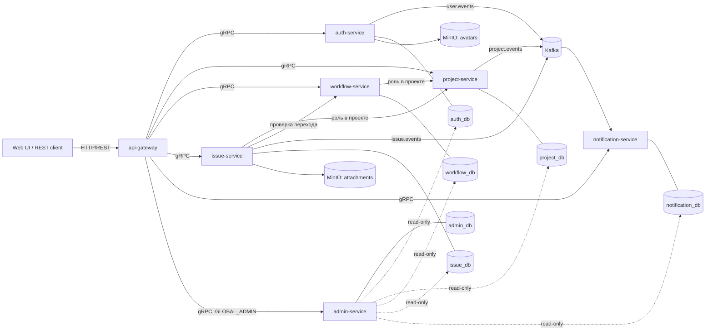

# Taska Backend

Backend системы управления проектами и задачами (аналог Jira). Проект построен как реактивный Java-монорепозиторий: внешний REST API принимает `api-gateway`, синхронное взаимодействие сервисов идёт по gRPC, доменные события доставляются через Kafka по шаблону transactional outbox, а каждый бизнес-сервис владеет отдельной PostgreSQL-базой.

## Текущее состояние

Реализованы:

- аутентификация по JWT, refresh-token rotation, блокировка после неудачных входов и приглашение пользователей;
- профиль пользователя и загрузка аватара через presigned URL;
- проекты, участники и роли `ADMIN`, `MEMBER`, `VIEWER`;
- настраиваемые workflow, статусы и проверка допустимости переходов;
- создание, просмотр, изменение, удаление, назначение, переходы и параметризованный поиск задач;
- история задач, комментарии и связи между задачами;
- проектные метки и привязка меток к задачам;
- вложения задач через S3-совместимое хранилище;
- наблюдатели задач, включая подписку текущего пользователя и управление наблюдателями;
- in-app и email-уведомления на основе Kafka-событий;
- административный read-only просмотр таблиц, маскирование чувствительных данных, журнал аудита и сводка проблемных outbox-событий;
- метрики Prometheus, дашборды Grafana и централизованные логи Loki/Promtail;
- автоматический AI review pull request с провайдерами OpenAI Codex или DeepSeek.

REST-контракт является источником истины для публичного API: [`api-gateway/src/main/resources/static/openapi.yml`](api-gateway/src/main/resources/static/openapi.yml).

## Архитектура



Внешнему клиенту нужен только `api-gateway`. HTTP-порты остальных сервисов предназначены прежде всего для Actuator; бизнес-контракты между сервисами опубликованы в `grpc-common-lib/src/main/proto`.

### Модули

| Модуль | Назначение |
|---|---|
| `api-gateway` | REST/BFF, OpenAPI, CORS, проверка access-токена и формирование контекста запроса |
| `auth-service` | пользователи, credentials, JWT, refresh/invite tokens, профиль и аватары |
| `project-service` | проекты, участники, проектные роли и события проектов |
| `workflow-service` | workflow, статусы, переходы и правила валидации |
| `issue-service` | задачи, поиск, история, комментарии, связи, метки, вложения и наблюдатели |
| `notification-service` | Kafka consumer, дедупликация событий, inbox и email-доставка |
| `admin-service` | глобальный административный read-only API, маскирование, аудит и мониторинг outbox |
| `common-lib` | общие доменные типы, события, исключения и R2DBC-конвертеры |
| `grpc-common-lib` | protobuf-контракты и сгенерированные gRPC/Reactor stubs |
| `kafka-lib` | общая реализация transactional outbox |
| `storage-lib` | реактивный S3-клиент и presigned URL |
| `metrics-starter` | автоконфигурация и аспект прикладных метрик |

### Основной стек

- Java 21;
- Spring Boot 4.0.3 и Spring WebFlux;
- Spring Data R2DBC и PostgreSQL 16;
- Spring gRPC, Protocol Buffers и Reactor gRPC;
- Kafka в KRaft-режиме;
- Liquibase;
- MinIO / AWS SDK v2;
- Prometheus, Grafana, Loki и Promtail;
- JUnit 6, Mockito и Testcontainers.

## Быстрый локальный запуск

### Требования

- JDK 21;
- Docker Engine с Compose v2;
- свободные локальные порты из таблицы ниже.

Maven устанавливать отдельно не требуется: в репозитории есть wrapper.

### 1. Подготовить окружение

Docker Compose использует корневой `.env` и для `env_file`, и для подстановки `${...}` в compose-файлах. Перед первым запуском создайте его из dev-шаблона.

PowerShell:

```powershell
Copy-Item .env.docker.example .env
```

Bash:

```bash
cp .env.docker.example .env
```

`.env` игнорируется Git. Значения из `.env.docker.example` предназначены только для локальной разработки.

### 2. Проверить Compose

```bash
docker compose -f docker-compose.yml -f docker-compose.dev.yml --profile infra --profile services config --quiet
```

### 3. Запустить систему

Весь стек:

```bash
docker compose -f docker-compose.yml -f docker-compose.dev.yml --profile infra --profile services up -d --build
```

Только инфраструктура:

```bash
docker compose -f docker-compose.yml -f docker-compose.dev.yml --profile infra up -d
```

Один сервис вместе с зависимостями, например `issue-service`:

```bash
docker compose -f docker-compose.yml -f docker-compose.dev.yml --profile infra --profile services up -d --build issue-service
```

Состояние контейнеров и последние логи:

```bash
docker compose ps
docker compose logs --tail=100 api-gateway
```

Остановка без удаления данных:

```bash
docker compose -f docker-compose.yml -f docker-compose.dev.yml down
```

Команда `docker compose down -v` дополнительно удаляет PostgreSQL, Kafka, Grafana, Prometheus и MinIO volumes. Используйте её только для осознанного полного сброса локальных данных.

## Локальные адреса

### Приложение

| Компонент | HTTP / Actuator | gRPC |
|---|---:|---:|
| `api-gateway` | `http://127.0.0.1:8080` | — |
| `auth-service` | `http://127.0.0.1:8081` | `127.0.0.1:9091` |
| `project-service` | `http://127.0.0.1:8082` | `127.0.0.1:9096` |
| `workflow-service` | `http://127.0.0.1:8083` | `127.0.0.1:9093` |
| `issue-service` | `http://127.0.0.1:8084` | `127.0.0.1:9094` |
| `notification-service` | `http://127.0.0.1:8085` | `127.0.0.1:9095` |
| `admin-service` | `http://127.0.0.1:8086` | `127.0.0.1:9097` |

Health check gateway:

```bash
curl http://127.0.0.1:8080/actuator/health
```

### Инфраструктура

| Компонент | Адрес |
|---|---|
| Swagger UI | [http://127.0.0.1:8080/swagger-ui.html](http://127.0.0.1:8080/swagger-ui.html) |
| OpenAPI YAML | [http://127.0.0.1:8080/openapi.yml](http://127.0.0.1:8080/openapi.yml) |
| Kafka UI | [http://127.0.0.1:8088](http://127.0.0.1:8088) |
| Grafana | [http://127.0.0.1:3000](http://127.0.0.1:3000) |
| Prometheus | [http://127.0.0.1:9090](http://127.0.0.1:9090) |
| Loki | `http://127.0.0.1:3100` |
| MinIO API / Console | `http://127.0.0.1:9000` / [http://127.0.0.1:9001](http://127.0.0.1:9001) |
| pgAdmin | [http://127.0.0.1:5050](http://127.0.0.1:5050) |
| Kafka broker | `127.0.0.1:9092` |
| PostgreSQL DB | `127.0.0.1:5433`–`5438` |

PostgreSQL-порты по порядку: `auth`, `project`, `workflow`, `issue`, `notification`, `admin`.

## API и безопасность

Публичные endpoints: login, refresh и принятие приглашения. Остальные пользовательские операции требуют `Authorization: Bearer <access-token>`. Read-only административные endpoints дополнительно требуют глобальную роль `GLOBAL_ADMIN`.

Основные группы REST API:

- `/api/v1/auth`, `/api/v1/users/me`;
- `/api/v1/projects` и участники проектов;
- `/api/v1/issues`, поиск, назначение и переходы;
- `/api/v1/projects/{projectId}/issues/{issueId}/comments`;
- `/api/v1/issues/{issueId}/links`;
- `/api/v1/projects/{projectId}/labels` и метки задач;
- `/api/v1/projects/{projectId}/issues/{issueId}/watchers`;
- `/api/v1/notifications`;
- `/api/v1/readonly` для глобального администратора.

Ограничения проектных операций задаются переменными `ISSUE_*_ROLES`. Полный состав запросов, ответов, статусов и параметров находится в OpenAPI-файле.

### Production checklist

Перед запуском вне локальной машины обязательно:

- заменить `JWT_SECRET`, `ADMIN_PASS`, пароли PostgreSQL, MinIO, Grafana и pgAdmin на уникальные секреты;
- задать SMTP credentials только через secret storage или переменные окружения, не коммитить их в Git;
- создать для `ADMIN_RO_*` отдельных PostgreSQL-пользователей только с правом `SELECT`; локальный пользователь `taska` не является read-only;
- не публиковать наружу gRPC, PostgreSQL, Kafka, MinIO API, Loki, Prometheus, pgAdmin и Kafka UI;
- ограничить `GATEWAY_CORS_ALLOWED_ORIGINS` доверенными HTTPS-origin;
- защитить внутреннюю сеть и межсервисный gRPC (mTLS или service identity), поскольку пользовательский контекст передаётся внутренними запросами;
- хранить `.env` вне репозитория и ротировать секрет сразу после подозрения на раскрытие;
- настроить резервное копирование баз и object storage, retention логов/метрик и алерты на `FAILED`/застрявшие outbox-события.

## Данные, события и файлы

Каждый сервис применяет собственные Liquibase-миграции при старте. Auth, project и issue сервисы сохраняют доменное изменение и outbox-событие в одной транзакции; publisher атомарно забирает пачку `NEW`-событий через `FOR UPDATE SKIP LOCKED`, публикует её в Kafka и переводит запись в `PUBLISHED` либо `FAILED`. Notification-service дедуплицирует входящие события по `event_id`.

Kafka topics:

| Topic | Producer | Consumer |
|---|---|---|
| `user.events` | `auth-service` | `notification-service` |
| `project.events` | `project-service` | `notification-service` |
| `issue.events` | `issue-service` | `notification-service` |

После исчерпания consumer retries сообщение направляется в topic `<source-topic>.DLT`.

`minio-init` создаёт buckets:

| Bucket | Содержимое |
|---|---|
| `taska-avatars` | аватары пользователей |
| `taska-attachments` | вложения задач |

Имена buckets, лимиты файлов, разрешённые MIME-типы и TTL presigned URL настраиваются через `.env` и `application.yml` соответствующего сервиса.

## Admin read-only API

`admin-service` предоставляет глобальному администратору:

- каталог доступных сервисов, таблиц и колонок;
- пагинацию, сортировку и типизированные фильтры `equals`, `contains`, `from`, `to`;
- получение строки по UUID primary key;
- маскирование настроенных колонок и полей JSON;
- аудит административных чтений в `admin_db`;
- сводку событий outbox в состояниях `FAILED` и просроченном `NEW`.

SQL-идентификаторы проверяются по фактическим метаданным, а значения фильтров передаются параметрами. Конфигурация разрешённых таблиц и чувствительных полей находится в `admin-service/src/main/resources/application.yml`. Подробности datasource — в [`admin-service/README.md`](admin-service/README.md).

## Наблюдаемость

Actuator публикует `health`, `info` и `prometheus`. Метрики собираются Prometheus, Grafana автоматически загружает дашборды метрик и логов, а Promtail отправляет Docker-логи в Loki.

В логах и ответах gateway используется сквозной `X-Request-Id`. Для поиска запроса в Grafana доступны фильтры сервиса, request ID, node ID и уровня логирования.

## Сборка и тесты

Компиляция и упаковка всех модулей без тестов:

```powershell
.\mvnw.cmd -DskipTests package
```

```bash
./mvnw -DskipTests package
```

Стандартный набор тестов:

```powershell
.\mvnw.cmd test
```

```bash
./mvnw test
```

Часть интеграционных тестов называется `*IntegrationTest` и входит в стандартный запуск; для неё должен быть доступен Docker/Testcontainers. Классы с суффиксом `*IT` текущей Maven-конфигурацией автоматически не выбираются. До подключения Maven Failsafe их можно запустить явно:

```bash
./mvnw test -Dtest="*IT,*IntegrationTest" -Dsurefire.failIfNoSpecifiedTests=false
```

Тест одного модуля с зависимостями:

```bash
./mvnw -pl issue-service -am test
```

В pull request CI запускает Maven verify по матрице модулей. Docker images собираются только для PR с label `docker`. Отдельный workflow выполняет структурированный AI review, если repository variable `AI_REVIEW_ENABLED=true`.

## Конфигурация и деплой

Базовый `docker-compose.yml` рассчитан на окружение с корневым `.env`; `docker-compose.dev.yml` добавляет loopback port mappings и профили `infra`/`services`. В production не подключайте dev override и публикуйте наружу только gateway или внешний reverse proxy.

При добавлении сервиса:

1. добавьте Maven-модуль в корневой `pom.xml`;
2. добавьте Dockerfile и сервис в Compose с фиксированной версией base image;
3. добавьте health check, `restart: unless-stopped` и нужную сеть;
4. добавьте переменные в `.env.docker.example` без реальных секретов;
5. добавьте сервис в Prometheus, Grafana/Promtail и CI matrices;
6. обновите OpenAPI/protobuf-контракты и этот README.
